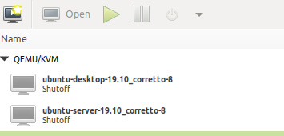

# Re-pack

Re-pack contains a collection of [Packer](https://packer.io/) templates for creating Re-core ready images for AWS, Digitalocean, KVM and LXD.

## Build

Make sure to install the latest Packer version first:

```bash
# Build Ubuntu 18.04 AMI
$ packer build -var 'aws_access_key=<access-key>' -var 'aws_secret_key=<secret-key>' src/aws/ubuntu-18.04/template.json

# Build ubuntu 18.04 Digitalocean image
$ packer build -var 'api_token=<your token>' src/digital/ubuntu-18.04/template.json

# Build ubuntu 18.04 KVM image (use -var iso_url=/path/to/iso if you have pre-downloaded iso)
$ packer build -var 'user=<your user>' -var 'password=<your pass>' src/kvm/ubuntu-18.04/ubuntu-18.04-server-amd64.json

# Build ubuntu 19.10 KVM image (use -var iso_url=/path/to/iso if you have pre-downloaded iso)
$ read -s password
$ packer build -var 'user=<your user>' -var "password=${password}" src/kvm/ubuntu-18.04/ubuntu-19.10-server-amd64.json

# Build ubuntu 18.04 LXD container
$ packer build -var 'user=<your user>' src/lxd/ubuntu-18.04/ubuntu-18.04-server-amd64.json

# Build an XFCE desktop varient
$ packer build -var 'user=<your user>' -var 'password=<your pass>' src/kvm/ubuntu-18.04/ubuntu-18.04-desktop-amd64.json

# Build an Ubutnu Mate desktop varient
$ read -s password
$ packer build -var 'user=<your user>' -var "password=${password}" src/kvm/ubuntu-19.10/ubuntu-19.10-desktop-amd64.json
```
## Deploy

When creating KVM images we need to deploy our images to a local/remote volume, for example:

```bash
# copying into the local default volume
$ cp output/*.img /var/lib/libvirt/images/
```

Now we create a new VM instance from the .img file that we just copied:

 

This VM instance will be used as the source template from which new VM instances are created.

In order to use this template:
* Make sure to add a bridged networking interface in addition to the NAT interface it already has.
* Re-core uses the following naming convention for images/templates {os-name}-{os-version}_name-{version}.

Note: AWS, LXC and Digitalocean don't require this step
